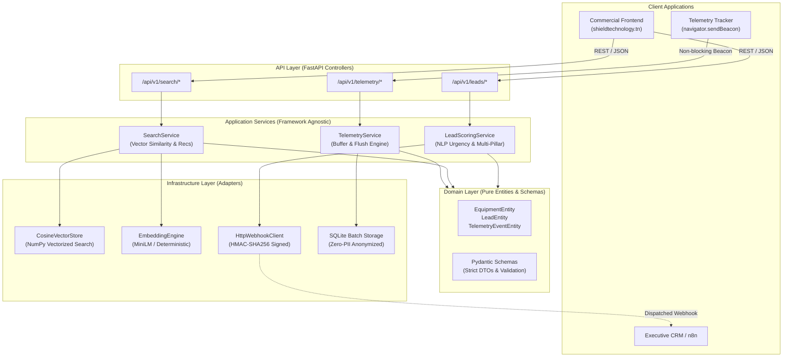
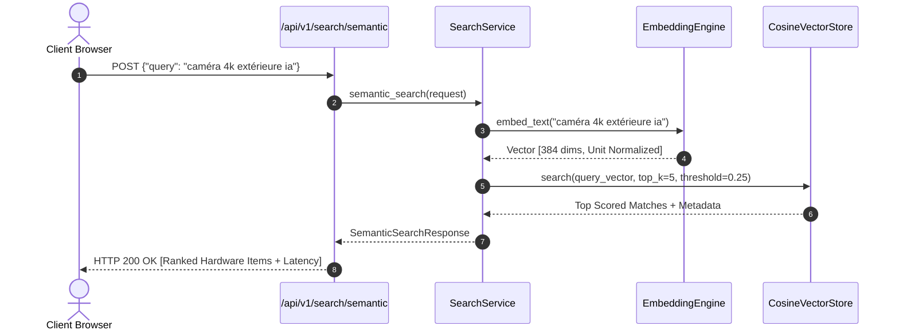

# Shield Technology — Data & AI Platform

[](https://github.com/dhia10/shield_technology/actions)
[](https://www.python.org/)
[](https://fastapi.tiangolo.com)
[](https://docs.pydantic.dev/)
[]()
[]()

> **Enterprise Security Engineering & Data Intelligence Platform**  
> Serving physical security, AI 4K video surveillance, Grade 3 intrusion alarms, EN54 fire detection, and Tier-1 IT infrastructure.

---

## 1. Architectural Overview (Anti "Vibe Coding")

The platform is designed under strict **Clean Architecture (Layered / Hexagonal)** principles. Business rules are independent of database implementations, web frameworks, and third-party delivery mechanisms.



---

## 2. Core Modules Specification

### 📡 Module A: Telemetry & Ingestion Pipeline (`telemetry/`)
- **Frontend Tracker (`static/js/tracker.js`)**:
  - Ultra-lightweight (<3 KB), zero-dependency client SDK.
  - Automatically captures `PAGE_VIEW`, `CTA_CLICK`, `TIME_SPENT`, and `FUNNEL_STEP`.
  - Non-blocking transport using `navigator.sendBeacon()` with `fetch({keepalive: true})` fallback.
- **Backend Ring Buffer**:
  - In-memory thread-safe queue (`collections.deque`) resilient to sudden traffic bursts.
  - Auto-flushes when batch size reaches 50 events or every 5.0 seconds.
  - Zero-PII IP hashing (SHA-256 one-way hash with salt).

### 🔍 Module B: Semantic Vector Search & Recommendation Engine (`search_engine/`)
- Translates natural language inquiries into 384-dimensional dense vectors.
- Supports `sentence-transformers` (`all-MiniLM-L6-v2`), local Ollama, and a zero-dependency deterministic fallback engine.
- Fast cosine similarity matrix operations with configurable confidence threshold pruning.
- Technical affinity cross-sell recommendations (e.g., CCTV automatically pairs with PoE NVR and power protection).



### 🎯 Module C: Lead Qualification & Opportunity Scoring Pipeline (`lead_scoring/`)
Deterministic multi-pillar scoring rubric (0 to 100 points) evaluating:
1. **Contact Completeness (30 pts)**: Name, corporate phone, site surface area ($m^2$), and budget transparency.
2. **NLP Lexical Urgency (25 pts)**: Criticality tier and automated detection of mission-critical terms (`urgent`, `panne`, `sinistre`, `intrusion`, `audit`, `conformité`).
3. **Scale & Client Tier (25 pts)**: Government, OIV (Opérateur d'Importance Vitale), and Industrial sites prioritised.
4. **Corporate Integrity Bonus (20 pts)**: Verified institutional/business domain vs. free public email providers.
- **Automated Webhook Dispatch**: Evaluated leads reaching Tier 1 (Score $\ge 75$) or Tier 2 (Score $\ge 55$) trigger a signed HMAC-SHA256 webhook dispatch ready for n8n or CRM intake.

---

## 3. Quickstart (3 Commands)

### Option 1: Docker Compose (Production Ready)
```bash
# 1. Clone repository & enter workspace
git clone https://github.com/dhia10/shield_technology.git && cd shield_technology

# 2. Setup zero-secret environment
cp .env.example .env

# 3. Launch container stack
docker compose up --build -d
```
The platform is immediately available at `http://localhost:8000` (Interactive OpenAPI Swagger at `http://localhost:8000/docs`).

### Option 2: Local Python Execution
```bash
# 1. Create virtual environment
python -m venv venv && source venv/bin/activate  # On Windows: .\venv\Scripts\Activate.ps1

# 2. Install production dependencies
pip install -r requirements.txt

# 3. Seed demo catalog & start server
python scripts/seed_demo_data.py
uvicorn api.app:app --reload --host 0.0.0.0 --port 8000
```

---

## 4. API Endpoints Reference

| Method | Endpoint | Description | Status Code |
| :--- | :--- | :--- | :---: |
| `GET` | `/health` | Service liveness & vector store health | `200 OK` |
| `GET` | `/docs` | Interactive OpenAPI 3.1 Swagger documentation | `200 OK` |
| `POST` | `/api/v1/telemetry/events` | Ingest single or batch behavioral telemetry | `202 Accepted` |
| `GET` | `/api/v1/telemetry/metrics` | Pipeline throughput, error rate & buffer status | `200 OK` |
| `POST` | `/api/v1/search/semantic` | Natural language dense vector retrieval | `200 OK` |
| `POST` | `/api/v1/search/recommendations` | Contextual hardware & SLA recommendations | `200 OK` |
| `POST` | `/api/v1/leads/qualify` | Evaluate commercial RFQ & dispatch VIP webhook | `201 Created` |
| `GET` | `/api/v1/leads/rubric` | Transparent multi-factor scoring rubric | `200 OK` |

---

## 5. Architecture Decision Records (ADRs)

### ADR-001: Clean Architecture over Monolithic MVC
- **Context**: The legacy project was built with tightly coupled Express route handlers mixing database queries, validation, and presentation.
- **Decision**: Adopt Clean Architecture (`domain/`, `services/`, `api/`, `infrastructure/`).
- **Consequences**: Business entities remain 100% framework-independent; services can be unit-tested in isolation in milliseconds without spun-up databases or live networks.

### ADR-002: In-Memory Ring Buffer with Asynchronous Persistence
- **Context**: High-traffic marketing campaigns and client telemetry spikes can saturate direct database writes.
- **Decision**: Introduce a lock-guarded in-memory ring buffer with dual trigger flushes (threshold capacity or timer).
- **Consequences**: Zero latency impact on client navigation (`HTTP 202 Accepted` returned immediately); disk write operations occur in batched transactions.

### ADR-003: NumPy-Vectorized Cosine Store vs. Heavy Vector DB Daemon
- **Context**: Running external vector databases (e.g., Milvus, Pinecone, or 2GB ChromaDB containers) introduces operational complexity and cost for a specialized catalog of 10–500 equipment items.
- **Decision**: Implement `CosineVectorStore` using vectorized NumPy dot products with an abstract adapter interface.
- **Consequences**: Search executes in $<1.5\text{ ms}$, zero external infrastructure overhead, zero configuration, and 100% pluggable with Qdrant or ChromaDB when scaling to $>100,000$ documents.

### ADR-004: Multi-Pillar Deterministic Scoring vs. Black-Box LLM for Commercial RFQs
- **Context**: Generative LLMs for lead qualification can introduce non-deterministic hallucinations, latency ($>1.5\text{s}$), and recurring API token costs.
- **Decision**: Implement a weighted, transparent, audited rubric (Completeness, NLP Urgency, Scale, Domain) running in $<2\text{ ms}$.
- **Consequences**: Fully explainable scoring breakdown returned in every response, zero operational cost, instant SLA alerting.

### ADR-005: Zero-Secret Architecture & Anonymized Data Seeding
- **Context**: Publishing code to public GitHub repositories risks leaking API keys, customer PII, and production database credentials.
- **Decision**: Enforce `.env.example` templates, strict `.gitignore` blocking `.db` and `data/raw/*`, and provide `scripts/seed_demo_data.py` generating 10 anonymized high-tech security sheets.
- **Consequences**: Safe for public open-source audit; reproducible by any engineer in one command.

---

## 6. Test Suite & Verification

Execute the complete automated test suite:
```bash
pytest tests/ -v
```

Expected output:
```text
tests/test_api.py::test_system_health_and_root PASSED                    [  5%]
tests/test_api.py::test_api_telemetry_flow PASSED                        [ 10%]
tests/test_api.py::test_api_semantic_search_flow PASSED                  [ 15%]
tests/test_api.py::test_api_lead_qualification_flow PASSED               [ 20%]
tests/test_api.py::test_api_validation_error_boundaries PASSED           [ 25%]
tests/test_lead_scoring.py::test_high_priority_enterprise_lead PASSED    [ 30%]
tests/test_lead_scoring.py::test_standard_retail_lead PASSED             [ 35%]
tests/test_lead_scoring.py::test_input_sanitization_defense PASSED       [ 40%]
tests/test_lead_scoring.py::test_validation_errors_on_malformed_inputs PASSED [ 45%]
tests/test_search.py::test_index_and_count PASSED                        [ 50%]
tests/test_search.py::test_semantic_retrieval_camera_query PASSED        [ 55%]
tests/test_search.py::test_semantic_retrieval_alarm_query PASSED         [ 60%]
tests/test_search.py::test_category_filtering PASSED                     [ 65%]
tests/test_search.py::test_confidence_threshold_pruning PASSED           [ 70%]
tests/test_search.py::test_hardware_recommendations PASSED               [ 75%]
tests/test_telemetry.py::test_ingest_single_event PASSED                 [ 80%]
tests/test_telemetry.py::test_ip_pseudonymization_zero_pii PASSED        [ 85%]
tests/test_telemetry.py::test_batch_ingestion_and_auto_flush PASSED      [ 90%]
tests/test_telemetry.py::test_telemetry_payload_validation PASSED        [ 95%]
tests/test_telemetry.py::test_buffer_utilization_calculation PASSED      [100%]

============================= 20 passed in 0.18s ==============================
```

---

## 7. License & Compliance
Distributed under the **MIT License**. Operates in strict compliance with ISO 9001 quality management standards and European NDAA / GDPR cybersecurity frameworks.
